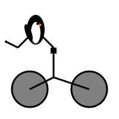

# svg-vision-reflection

A small Python library that generates SVG images from text prompts using an
OpenAI-compatible LLM, and iteratively refines them by feeding the rendered
PNG back to the model (vision-based reflection).

Usage:
```
svg = generate_svg("a penguin riding a bike shown from the side")
```

Or, for fun and visualizing the refinement history ([read full example](demo.ipynb)):
```
svg, history = generate_svg("a penguin riding a bike shown from the side", num_reflections=20, report_history=True)
```



Inspired by [Simon Willison’s experiments](https://simonwillison.net/2025/Jun/6/six-months-in-llms/).

## Installation

```bash
git clone https://github.com/haesleinhuepf/svg-vision-reflection
cd svg-vision-reflection
pip install -e .
```

> **Requirements:** an OpenAI API key in the `OPENAI_API_KEY` environment
> variable (or a custom client passed to the function).

## Usage

```python
from svg_vision_reflection import generate_svg

# Generate an SVG with 2 rounds of visual reflection (default)
svg = generate_svg("a sunset over the ocean")
print(svg)  # raw SVG string

# Save to file
with open("output.svg", "w") as f:
    f.write(svg)
```

### API

```python
generate_svg(
    prompt: str,
    num_reflections: int = 2,
    report_history: bool = False,
    model: str = "gpt-4o",
    openai_client: openai.OpenAI = None,
) -> str | tuple[str, list[tuple[str, bytes]]]
```

| Parameter | Description |
|---|---|
| `prompt` | Natural-language description of what the SVG should show. |
| `num_reflections` | Number of vision-based refinement iterations (default `2`). |
| `report_history` | When `True`, returns `(svg, history)` where *history* is a list of `(svg_str, png_bytes)` tuples, one per iteration. |
| `model` | OpenAI model to use (default `"gpt-4o"`). |
| `openai_client` | Pre-configured `openai.OpenAI` instance (optional). |

## How it works

1. **Initial generation** – the prompt is sent to the LLM and an SVG is returned.
2. **Reflection loop** (repeated `num_reflections` times):
   - The current SVG is rendered to PNG via `cairosvg`.
   - Both the SVG source *and* the PNG image are sent back to the model with
     a request to improve the SVG if it doesn't match the description.
3. The final SVG string is returned.

